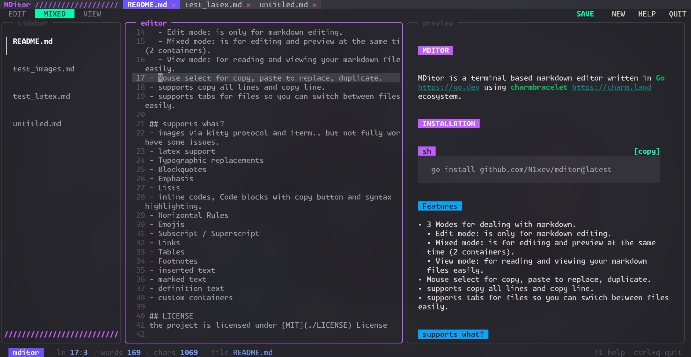

# MDitor

MDitor is a terminal based markdown editor written in [Go](https://go.dev) using [charmbracelet](https://charm.land) ecosystem.


# Installation

```sh
 go install github.com/N1xev/mditor@latest
```

## Features

- 3 Modes for dealing with markdown.
  - Edit mode: is only for markdown editing.
  - Mixed mode: is for editing and preview at the same time (2 containers).
  - View mode: for reading and viewing your markdown files easily.
- Mouse select for copy, paste to replace, duplicate.
- supports copy all lines and copy line.
- supports tabs for files so you can switch between files easily.

## supports what?
- images via kitty protocol and iterm.. but not fully work. have some issues.
- latex support
- Typographic replacements
- Blockquotes
- Emphasis
- Lists
- inline codes, Code blocks with copy button and syntax highlighting.
- Horizontal Rules
- Emojis
- Subscript / Superscript
- Links
- Tables
- Footnotes
- inserted text
- marked text
- definition text
- custom containers

## LICENSE
the project is licensed under [MIT](./LICENSE) License
